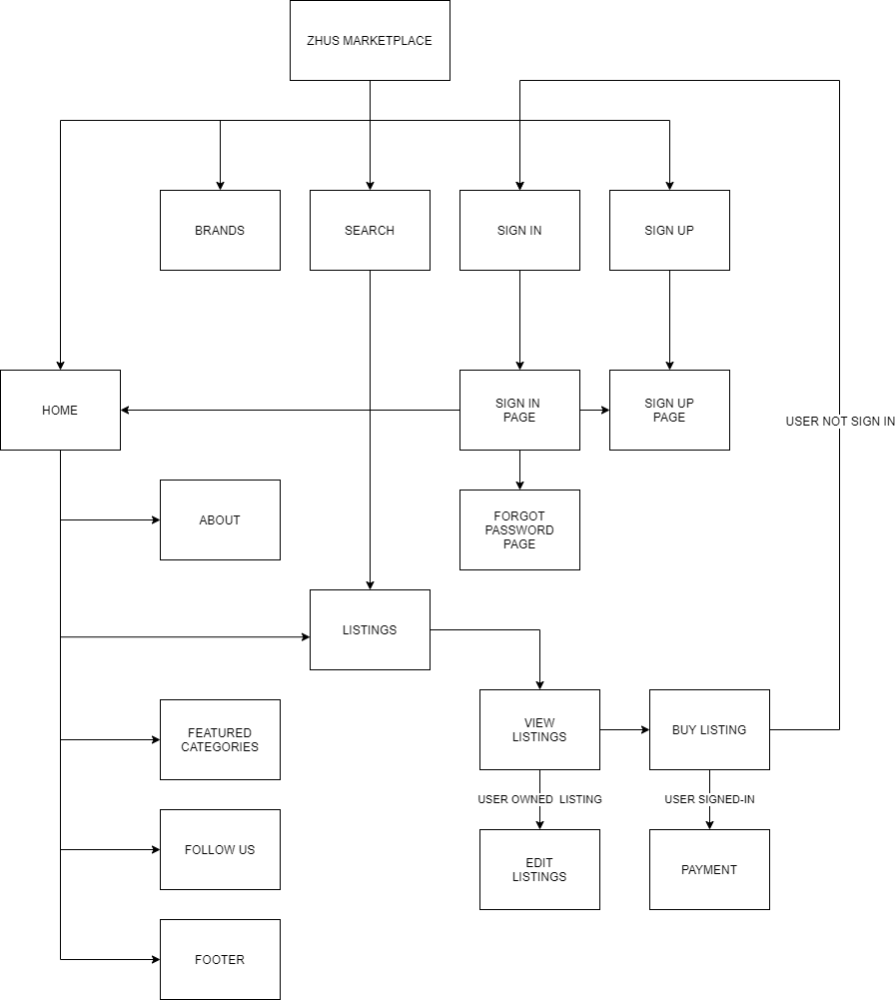
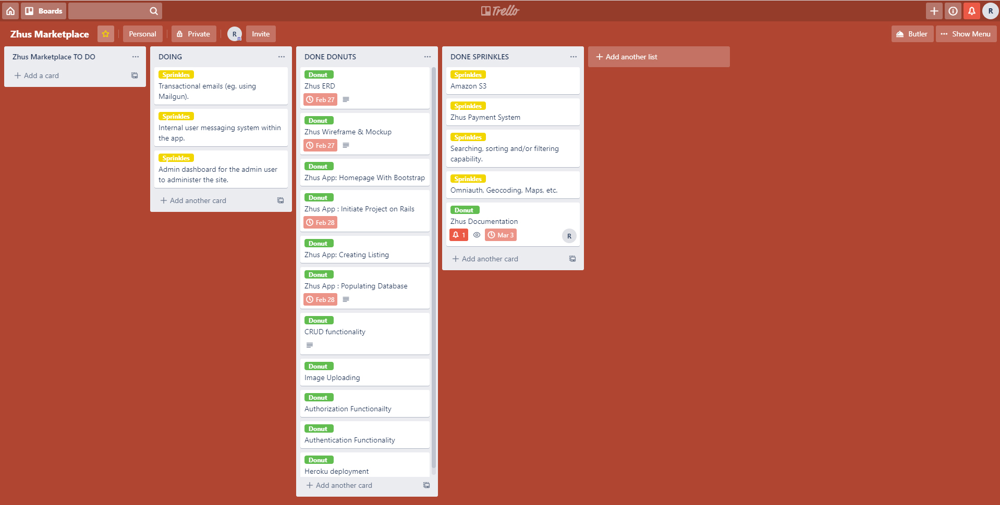

# Problems that needs to be solve

At present, there is no similar marketplace that exist specifically for buying and selling of brand new or pre-loved shoes. There is a big community of people who are interested in shoe collection but are struggling to get the desired shoes because of unavailability. 

# 
This will cater to the following: 

* People who are having a hard time disposing their pre-loved shoes can use this application to make their listings.
* People who are looking for affordable brand new or pre-loved shoes.
* People who are searching for specific type of shoes which is unavailable at any shoe retailer.

# Links to Zhus Marketplace

Webiste Link

* Website : https://zhus-marketplace.herokuapp.com

Github Links

* (Docs, Readme, Zhus-Marketplace application) Repository : https://github.com/Kenneth-Rimorin/Zhus_Marketplace

* Zhus-Marketplace-Application Repository : https://github.com/Kenneth-Rimorin/Zhus-Marketplace-Application

# Description of Zhus Marketplace
## Purpose
The purpose of Zhus marketplace is to provide buyers and sellers with one easy, convenient destination to explore and exchange a wide variety of shoes. This marketplace platform will allow all users to buy and sell shoes based on their styles, needs, wants and price. 
## Functionality &  Features
Funtionality
* User can sign up to create a Zhus account.
* User can log-in using the account created.
* Logged-in user can create listing.
* Logged-in user will not have the authority to edit and delete created listing.
* Logged-in user can buy a listed item. 
* Other Logged-in user will not be able to edit or delete other listing.
* Image uploading Capability.

Features
* Zhus Marketplace has a working search feature.
* Zhus Marketplace handles online payment system.
* Zhuz Marketplace uses Amazon S3 for all image storage.
* Zhus Marketplace Web application is responsive to all media types
* Website provides easy navigation.
* Trendy, intuitive design and user experience.
* Uses reputable database
* Uses live google maps

# Zhuz-Marketplace Sitemap
  
## Screenshots
Homepage

Listings

Log-in Page

Sign-up Page

Creating Listing Page

View Listing Page

User Logged-in View Listing Page

Payment Page

## Target Audience

The target audience of Zhus Marketplace are people who are looking for a cheap brand new or used pairs of shoes. Sneaker heads or shoes enthusiast who are having a hard time looking for a pair of shoes that they wanted to collect. 

## Tech Stack

The Tech Stack that Zhus Marketplace used are the following :

Frontend

* CSS
* HTML
* Bootstrap
* JavaScript
* Photoshop

Backend

* Windows Subsystem for Linux(Ubuntu)
* Ruby on Rails Framework
* Postgresql
* Heroku
* Ruby Programming Language
* Amazon S3
* Git Version control
* Dbeaver
* Visual Studio Code

# User Stories
* As a user of Zhus marketplace, i want to be able to sell my shoes online.
* As a user of Zhus marketplace, i want to shop shoes online.
* As a user of Zhus marketplace, i want to check and browse available shoes online.
* As a user of Zhus marketplace, i want to buy a pre-loved shoes online.
* As a user of Zhus marketplace, i want to buy cheaper and branded pair of shoes. 
* As a user of Zhus marketplace, i want to be able to pay online.

# Wireframes / Mockup of Zhus Marketplace

Mobile Homepage Wireframe Design

## Mockup Design
Mobile view Homepage

 Desktop view Homepage

# Zhus Database Structure 

## ERD of Zhus Marketplace

## High level components
* User - This component allows the application to sign-up and store a registered user which will be then validated by the application for authentication and authorization.If the log-in credentials matches the user table, then the user has the authority to log-in and do things within its approved scope like performing Create, Read, Update and Delete(CRUD) operation on a listing which the user will create or created, be able to buy a listing created by other user.

* Listing - This component provides the details of all the listings on the application such as name, color, size, price, description, category and brand. also, it tracks the user which created the listing. In order to allow a user to create a listing for sale, a user must register an account and sign-in in the application.

* Brands - This component refers to the listings component. All listings must have its own brand. Brand is where the buyer looks after for a shoes.

* Places - This component is used mainly for generating google maps for the application. 

* Payments - This component is where the user finalizes his/her order and proceed with the purchased. The application uses Stripe for its payment system.

## Third party services
* Devise - Devise is Ruby gem which handles authentication of the user for the application. It provides forms for sign-in, sign-up and updating user 
information. Devise was used to generate user for the application.

* Ransack - Ransack is another Ruby gem that is mainly for sorting and searching a specific list or item depending on the parameters defined by the user. Ransack is being used in the app for searching a specific listing.

* Bootsrap - Bootstrap is a CSS framework which made the application responsive in all media types especially for mobile devices. It is more effecient for front-end web development. The application is equipped with bootstrap so it can be viewed nicely on mobile devices. 

* HTML & CSS - HTML and CSS are used for styling the application.

* Amazon S3 - Amazon AWS S3 is an Amazon service which provides an online storage for all the images that will be uploaded by the user on the application.

* Google Maps API - Google Maps is a web mapping service created by Google. The 
Application uses the Google Maps API to locate the application's office location for the user's aid.

* Postgresql - Postgresql is an advanced object-relational database management software. Data sharing and retrieval are much faster and it is safer.

* Stripe - Stripe is an online payment method that the application uses.

* Heroku - Heroku is a cloud platform that serves web applications. This application is deployed and serves in Heroku.

## Model Relationships

User Model and Listing Model

* User model has zero or many listings.
* Listing model belongs to User model.

Brand model and Listing Model

* Brand model has only one Listing model.
* Listing model has only one brand.

User Model and Review Model

* User model has only one Review.
* Review model belongs to User model.

User model, Listing model and Cart model

* User has zero to many listings model and has only one cart model.
* Listing model belongs to user and has only one cart.
* Cart model belongs to user model and has zero to many listings model.

Listing model, Question model and Answer model

* Listing has zero to many Question model.
* Question model belongs to Listing model.
* Question model has zero to many Answer model.
* Answer model belongs to Question model.

Database Relation Implementation

* User table has primary key which is generated automatically when a user signs up. This user primary key will be referenced and used across all tables as a foreign key which link up tables.

* Listing table has primary key which is geranated upon creation, Listing table contains the user id as a foreign key for tracking the user who created the listing. 

* Review table contains user id as a reference key to trace which user will put a review on the application.

* Question table and answer table has a foreign key of user id and listing id. Which identifies which user and listing it belongs to.

## Database Schema Design

User Table fields
* user_id : int
* email : varchar
* encrypted_password : varchar
* reset_password_token : varchar
* reset_password_sent_at : timestamp
* remember_created_at : timestamp
* created_at : timestamp 
* updated_at : timestamp
* name : varchar
* address : varchar
* mobile : int

Listing table fields

* listing_id : int
* name : varchar 
* user_id : int
* brand_id : int
* color : varchar
* size : int
* price : int
* category : varchar 
* description : varchar
* created_at : timestamp
* updated_at : timestamp

Brands table

* brand_id : int
* name : varchar
* created_at : timestamp
* updated_at : timestamp

## Task management

Implemented task management skill using Trello
link : https://trello.com/b/wT3EU1E6/zhus-marketplace

